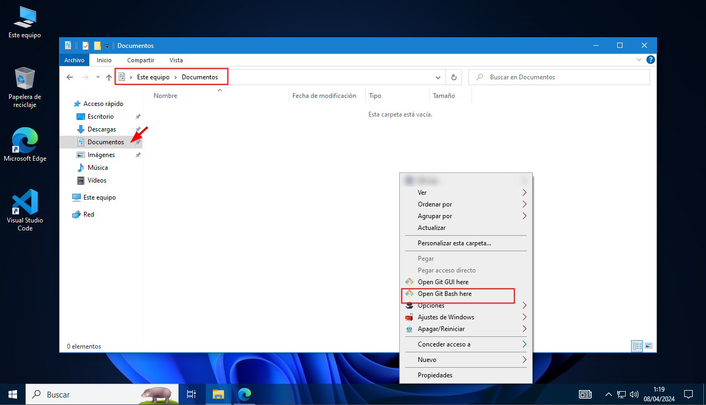
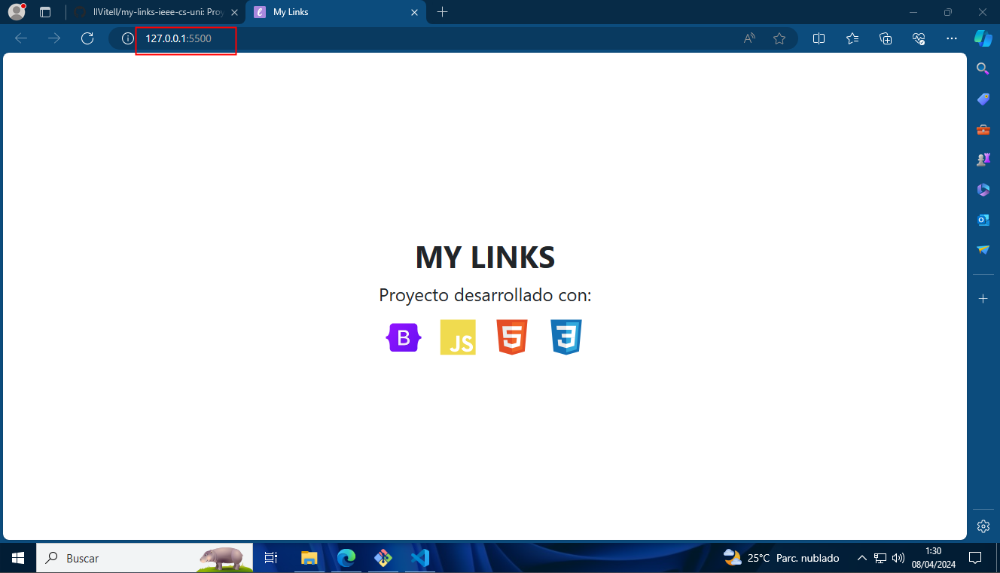
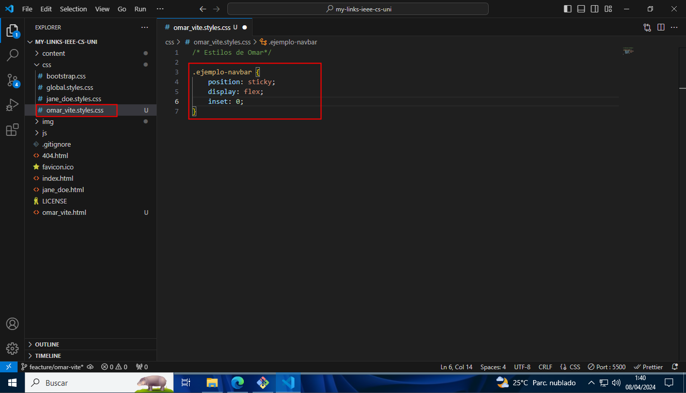

# Aprendiendo GIT: My Links APP

## 1. Introducción

Proyecto simple que permite a cada usuario crear sus propios enlaces, los cuales pueden ser visualizados por cualquier persona que tenga el link de acceso.

## 2. Objetivos

- Crear un proyecto simple que permita a los usuarios crear sus propios enlaces.
- Permitir a los usuarios compartir sus enlaces con otras personas.

## 3. Requisitos

Tenemos que tener instaladas las siguientes herramientas:

Herramienta | Enlace de descarga
------------ | -------------
Git | [Descargar](https://git-scm.com/)
Visual Studio Code | [Descargar](https://code.visualstudio.com/)

### 3.1. Instalación de Git

Para instalar Git, debemos seguir los siguientes pasos:

Ingresamos a la página oficial de Git: [Git](https://git-scm.com/)


Luego hacemos clic en el botón "Download" para descargar el instalador de Git.


Una vez descargado el instalador, lo ejecutamos y hacemos clic en el botón "Ejecutar".


Aceptar los términos de la licencia y hacer clic en el botón "Siguiente".


Seleccionar la ubicación de instalación y hacer clic en el botón "Siguiente".


Seleccionamos siguiente y esperamos a que termine la instalación.


Una vez finalizada la instalación, hacemos clic en el botón "Finalizar".


> **Nota:** Debemos tener una cuenta en GitHub para poder clonar el repositorio para eso nos dirigimos a [GitHub](https://github.com) y creamos una cuenta.

#### Crear una cuenta en GitHub

Ingresamos a la página oficial de GitHub: [GitHub](https://github.com)


Ingresamos nuestro nombre de usuario, correo electrónico y contraseña. Luego hacemos clic en el botón "Sign up for GitHub".


### 3.2. Configuración de Git

Después de instalar Git, debemos configurar nuestro nombre de usuario y correo electrónico. Para ello, abrimos la consola de Git y ejecutamos los siguientes comandos:

```bash
git config --global user.name "tu nombre"
git config --global user.email "tu correo"
```

Primero hacemos click derecho en el escritorio y seleccionamos la opción "Git Bash Here".


Luego ejecutamos los comandos en la consola de Git.

```bash
git config --global user.name "Omar Vite"
git config --global user.email "omar******@uni.pe"
```


Para verificar que la configuración se haya realizado correctamente, ejecutamos el siguiente comando:

```bash
git config --list
```


### 3.3. Instalación de Visual Studio Code

Para instalar Visual Studio Code, debemos seguir los siguientes pasos:

Ingresamos a la página oficial de Visual Studio Code: [Visual Studio Code](https://code.visualstudio.com/) y hacemos clic en el botón del sitema operativo que estemos utilizando en este caso Windows.


Descargamos el instalador de Visual Studio Code.


Una vez descargado el instalador, lo ejecutamos haciendo doble clic y hacemos clic en el botón "Ejecutar".


Aceptamos los términos de la licencia y hacemos clic en el botón "Siguiente".


Seleccionamos la ubicación de instalación y hacemos clic en el botón "Siguiente".


Seleccionamos el path de inicio y hacemos clic en el botón "Siguiente".


Finalizamos la instalación haciendo clic en el botón "Finalizar".


### 3.4. Configuración de Visual Studio Code

Después de instalar Visual Studio Code, debemos instalar las siguientes extensiones:

Extensión | Descripción
------------ | -------------
Live Server | Permite visualizar los cambios en tiempo real en el navegador.
Prettier | Formatea el código automáticamente.

Para instalar las extensiones, debemos abrir Visual Studio Code y buscar la extensión en la barra lateral izquierda.


Luego escribimos liver server en la barra de búsqueda y hacemos clic en el botón "Install".


De igual forma, podemos instalar la extensión de Prettier.


## 4. Crear un fork del repositorio

Para poder trabajar en el proyecto, debemos crear un fork del repositorio. Para ello, debemos seguir los siguientes pasos:

Ingresamos al repositorio del proyecto: [My Links - IEEE CS UNI](https://github.com/jhonnatan1806/my-links-ieee-cs-uni) y hacemos clic en el botón "Fork" que se encuentra en la parte superior derecha de la pantalla.


Luego el nombre de nuestro repositorio y le damos en el botón "Create fork".


Verificamos que se haya creado nuestro repositorio.


## 5. Clonar el repositorio

Copiamos la URL de nuestro repositorio.


Abriremos la consola de Git y nos ubicaremos en la carpeta donde queremos clonar el repositorio.



Clonamos el repositorio en nuestra máquina local. Para ello, abrimos la consola de Git y ejecutamos el siguiente comando:

```bash
  git clone <url de nuestro repo>
```


Nos ubicamos en la carpeta del proyecto:

```bash
cd my-links-ieee-cs-uni
```


## 6. Crear un branch

Para crear una rama, debemos ejecutar el siguiente comando:

```bash
git branch feature/<nombre-apellido>
```


Para cambiar de rama, debemos ejecutar el siguiente comando:

```bash
git checkout feature/<nombre-apellido>
```


---

## 7. Actividad: Personalizar mi perfil

Primero debemos ingresar al proyecto para ello debemos ejecutar el siguiente comando:

```bash
code .
```


Si es la primera vez que utilizamos el directorio nos aparecera una ventana para aceptar que es un directorio de trabajo seguro.


Luego debemos enceder el servidor de Live Server para ello debemos hacer clic en el botón "Go Live" que se encuentra en la parte inferior derecha de la pantalla.


La primera vez nos pedira que permitamos el acceso a la red privada.


Ahora podremos visualizar nuestro proyecto en el navegador.



### 7.1. Crear un archivo HTML

Para crear un archivo podemos usar la siguiente forma `nombre_apellido.html` en la carpeta principal del proyecto.


> **Nota:** Puedes utilizar el archivo `jane_doe.html` como referencia.

### 7.2. Estructura para subir archivos

Si necesitas agregar archivos puedes hacerlos en la carpeta `files` con el formato `<nombre>.<tipo>.<extension>` y referenciarlas en tu archivo HTML.


```html
<a href="files/jane_doe.cv.pdf" download>Descargar CV</a>
```

### 7.3. Estructura para subir imagenes

Si necesitas agregar imagenes puedes hacerlos en la carpeta `img` con el formato `<nombre>.<tipo>.<extension>` y referenciarlas en tu archivo HTML.


```html

```

### 7.4. Estructura para subir estilos

Si necesitas agregar estilos puedes hacerlos en la carpeta `css` con el formato `<nombre>.<tipo>.<extension>` y referenciarlas en tu archivo HTML.



```html
<!-- Los estilos deben estar en el head del archivo HTML -->
<link rel="stylesheet" href="css/jane_doe.styles.css">
```


### 7.5. Subir los cambios al repositorio remoto

Para subir los cambios a nuestro repositorio remoto, primero revisaremos el estado de nuestro repositorio con el siguiente comando:

```bash
git status
```


Luego agregamos los cambios con el siguiente comando:

```bash
git add .
```


luego verificamos que los cambios se hayan agregado correctamente.

```bash
git status
```


Ahora haremos un commit con el siguiente comando:

```bash
git commit -m "feat: Agregado archivo <nombre-apellido>.html"
```


Por último subimos los cambios a nuestro repositorio remoto con el siguiente comando:

```bash
git push origin feature/<nombre-apellido>
```


Si es la primera vez que subimos los cambios nos pedira que iniciemos sesión en GitHub.


Luego de iniciar sesión podremos ver que los cambios se subieron correctamente.


### 7.6. Crear un Pull Request

Nos dirigimos a nuestro repositorio en GitHub y hacemos clic en el botón "Compare & pull request".


Escribimos un mensaje y hacemos clic en el botón "Create pull request".


Una vez creada nuestra pull request, esperaremos a que sea revisada y aprobada por el administrador del proyecto.


