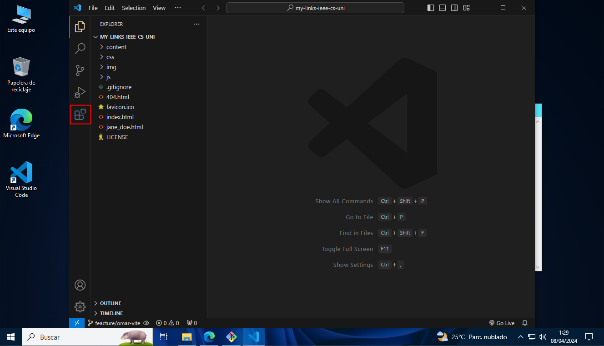

# My Links

## 1. Introducción

Proyecto simple que permite a cada usuario crear sus propios enlaces, los cuales pueden ser visualizados por cualquier persona que tenga el link de acceso.

## 2. Objetivos

- Crear un proyecto simple que permita a los usuarios crear sus propios enlaces.
- Permitir a los usuarios compartir sus enlaces con otras personas.

## 3. Requisitos

Tenemos que tener instaladas las siguientes herramientas:

Herramienta | Enlace de descarga
------------ | -------------
Git | [Descargar](https://git-scm.com/)
Visual Studio Code | [Descargar](https://code.visualstudio.com/)

### 3.1. Instalación de Git

Para instalar Git, debemos seguir los siguientes pasos:


> **Nota:** Debemos tener una cuenta en GitHub para poder clonar el repositorio para eso nos dirigimos a [GitHub](https://github.com) y creamos una cuenta.


### 3.2. Configuración de Git

Después de instalar Git, debemos configurar nuestro nombre de usuario y correo electrónico. Para ello, abrimos la consola de Git y ejecutamos los siguientes comandos:

```bash
git config --global user.name "tu nombre"
git config --global user.email "tu correo"
```


### 3.3. Instalación de Visual Studio Code


### 3.4. Configuración de Visual Studio Code

Después de instalar Visual Studio Code, debemos instalar las siguientes extensiones:

Extensión | Descripción
------------ | -------------
Live Server | Permite visualizar los cambios en tiempo real en el navegador.
Prettier | Formatea el código automáticamente.

Para instalar las extensiones, debemos abrir Visual Studio Code y buscar la extensión en la barra lateral izquierda.


## 4. Clonar el repositorio

Para poder trabajar en el proyecto, debemos crear un fork del repositorio. Para ello, debemos seguir los siguientes pasos:

Ingresamos al repositorio del proyecto: [My Links](https://github.com/jhonnatan1806/my-links-ieee-cs-uni) y hacemos clic en el botón "Fork" que se encuentra en la parte superior derecha de la pantalla.


Clonamos el repositorio en nuestra máquina local. Para ello, abrimos la consola de Git y ejecutamos el siguiente comando:

```bash
  git clone <url de nuestro repo>
```

Nos ubicamos en la carpeta del proyecto:

```bash
cd my-links
```


## 5. Crear una rama

Para crear una rama, debemos ejecutar el siguiente comando:

```bash
git branch feature/<nombre-apellido>
```

Para cambiar de rama, debemos ejecutar el siguiente comando:

```bash
git checkout feature/<nombre-apellido>
```


---

## 6. Actividad: Personalizar mi perfil

Primero debemos ingresar al proyecto para ello debemos ejecutar el siguiente comando:

```bash
code .
```


Luego debemos enceder el servidor de Live Server para ello debemos hacer clic en el botón "Go Live" que se encuentra en la parte inferior derecha de la pantalla.


### 6.1. Crear un archivo HTML

Para crear un archivo podemos usar la siguiente forma `nombre_apellido.html` en la carpeta principal del proyecto.


> **Nota:** Puedes utilizar el archivo `jane_doe.html` como referencia.

#### Estructura para subir archivos

Si necesitas agregar archivos puedes hacerlos en la carpeta `files` con el formato `<nombre>.<tipo>.<extension>` y referenciarlas en tu archivo HTML.


```html
<a href="files/jane_doe.cv.pdf" download>Descargar CV</a>
```

#### Estructura para subir imagenes

Si necesitas agregar imagenes puedes hacerlos en la carpeta `img` con el formato `<nombre>.<tipo>.<extension>` y referenciarlas en tu archivo HTML.


```html

```

#### Estructura para subir estilos

Si necesitas agregar estilos puedes hacerlos en la carpeta `css` con el formato `<nombre>.<tipo>.<extension>` y referenciarlas en tu archivo HTML.


```html
<!-- Los estilos deben estar en el head del archivo HTML -->
<link rel="stylesheet" href="css/jane_doe.styles.css">
```


### 6.2. Subir los cambios al repositorio remoto

Para subir los cambios a nuestro repositorio remoto, debemos ejecutar los siguientes comandos:

```bash
git add .
git commit -m "feat: Agregado archivo <nombre-apellido>.html"
git push origin feature/<nombre-apellido>
```





### 6.3. Crear un Pull Request

Ahora entraremos a nuestro repositorio en GitHub y haremos clic en el botón "Compare & pull request". Luego, escribiremos un mensaje y haremos clic en el botón "Create pull request".


